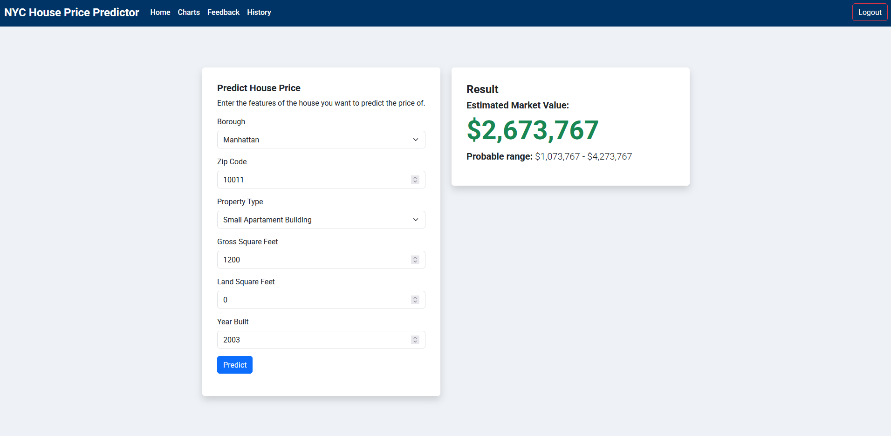
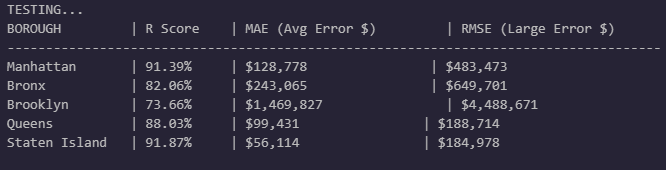

# 🗽 NYC House Price Predictor

A machine learning-powered web application that estimates residential property prices in New York City. This tool analyzes historical sales data from 2021 to provide market value estimates and confidence ranges for properties across all five boroughs.



## 📋 Project Overview

The NYC Real Estate market is one of the most complex and volatile in the world. This project aims to simplify property valuation by using **Data Science** to identify patterns in sales data.

The application allows users to input key property details (location, size, type) and returns a predicted price along with a probable market range based on the model's historical margin of error.

---

## 🛠️ Tech Stack

### Backend & Machine Learning
* **Python 3.12**
* **Flask**
* **SQLite**
* **Scikit-Learn**
* **Pandas & NumPy**
* **Joblib**

### Frontend
* **HTML5 / CSS3**
* **Bootstrap**
* **JavaScript**
* **Chart.js**

---

## 🤖 The Data Science Approach

### The Algorithm: Random Forest Regressor
We selected the **Random Forest Regressor** as our core algorithm after rigorous testing against Linear Regression and K-Nearest Neighbors (KNN).

### Architecture: The "Borough-Expert" System
Instead of a single monolithic model, the system uses an **Ensemble of 5 Specialized Models**—one for each borough (Manhattan, Brooklyn, Queens, The Bronx, Staten Island). This allows the system to capture the unique economic dynamics of each distinct market.

### Why Random Forest?
1.  **Non-Linearity:** Real estate prices do not scale linearly. A 2,000 sqft house is not necessarily worth double a 1,000 sqft house. Random Forest handles these non-linear relationships excellently via decision trees.
2.  **Robustness to Outliers:** NYC data contains extreme outliers (e.g., $50M luxury penthouses vs. $200k family homes). Linear Regression is easily skewed by these extremes, whereas Random Forest isolates them, preventing them from ruining the prediction for average homes.
3.  **Handling Categorical Data:** The algorithm effectively processes geographical data (Zip Codes) and Property Types (Single Family, Condos, etc.) without needing complex normalization.

### Advantages Over Other Models
* **vs. Linear Regression:** Random Forest reduced the Mean Absolute Error (MAE) significantly, as Linear Regression failed to capture the complexity of neighborhoods like Brooklyn.
* **vs. KNN:** Random Forest is faster at prediction time (inference) and handles high-dimensional categorical data (like Zip Codes) better without suffering from the "curse of dimensionality."

---

## 📊 Model Performance & Validation

To ensure reliability, the models were audited using a "Smoke Test" and a full statistical evaluation using `r2_score` and `MAE`.



---

## ⚙️ How to Run Locally

2.  **Create a Virtual Environment:**
    ```bash
    python -m venv venv
    source venv/bin/activate 
    ```

3.  **Install Dependencies:**
    ```bash
    pip install -r requirements.txt
    ```


5.  **Run the App:**
    ```bash
    python run.py
    ```
    Access the app at `http://127.0.0.1:5000`

---
