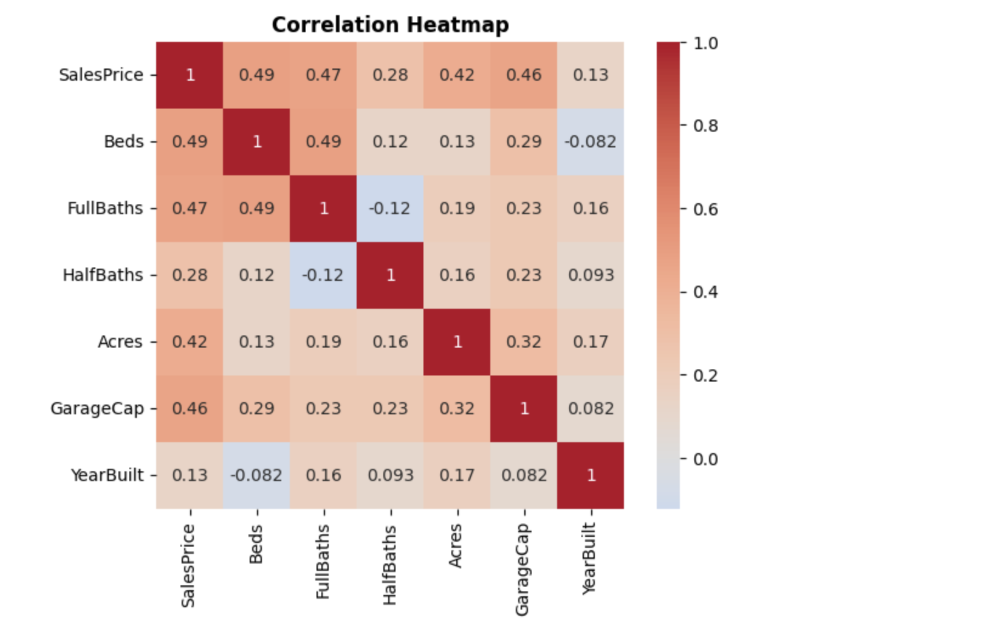
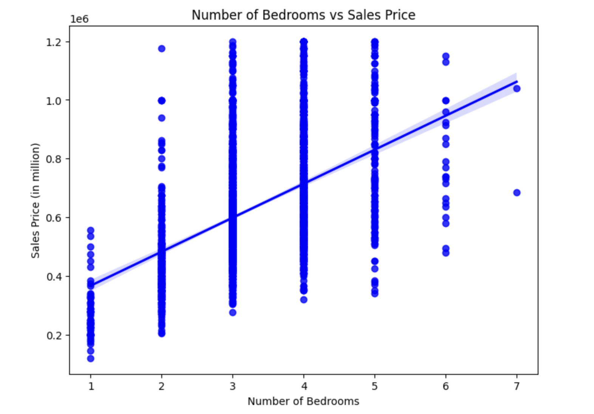
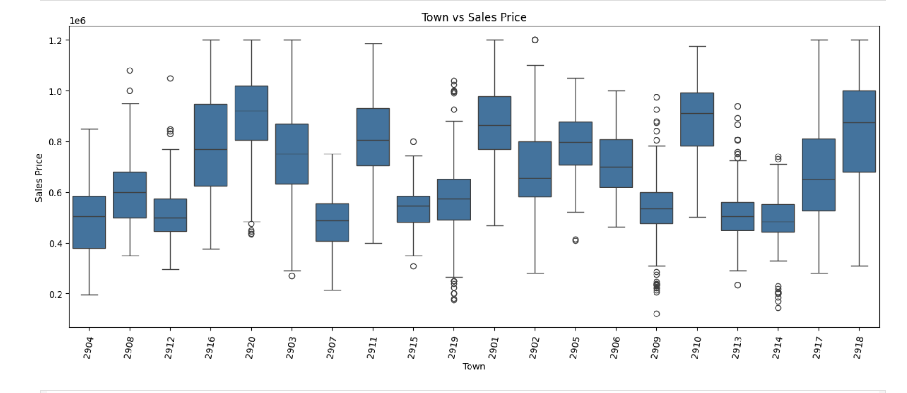

## A Housing Predictor
### Objective
The goal of this project is to create a full-stack application of a website that is able to predict
the sales price of a house based on what the user inputs. This is accomplished by examining the features
of houses and making a model to estimate these house prices. 


---

##  What Can It Do?

*  Secure Login: Users can create an account and log in safely to save their sessions.
*  Instant Predictions: Enter housee details (like bedrooms, bathrooms, and town) to get a price estimate immediately.
*  Simple Design: A clean, easy-to-use interface.
*  Used Model: Uses the K-Nearest Neighbors (KNN) algorithm to find similar houses and calculate an accurate price.

---

##  Data Analysis (The Math Behind It)

Before building the app, we analysed the housing data to understand what drives prices up or down. Here are our findings:

### 1. Which features matter most?
We used a correlation heatmap to see how different features connect to the price.
* **Insight:** The red squares show the strongest connections. We found that the **Number of Bedrooms** (0.49 correlation) and **Full Bathrooms** (0.47 correlation) are the most important factors for predicting price.


### 2. Do more bedrooms equal higher prices?
We plotted the number of bedrooms against sales prices.
* **Insight:** As shown by the blue line trending upward, there is a clear positive relationship. Houses with more bedrooms generally sell for a higher price.


### 3. Does location change the price?
We grouped house prices by "Town ID" to see how location affects value.
* **Insight:** The boxplot shows that some towns have a much higher average price range than others. This confirms that **location** is a critical part of our prediction model.


---

##  Tech Used

We used the following technologies to build this project:

* **Frontend (The Website):** HTML, CSS, Bootstrap
* **Backend (The Server):** Python, Flask
* **Database (Storage):** MySQL
* **Machine Learning (The Brains):** Scikit-learn (KNN Algorithm), Pandas, NumPy

---

##  Project Structure


Here is how the project files are organised:
```
house-app/
│
├── app/
│   ├── static/                  # CSS, Images
│   ├── templates/               # HTML Templates
│   │   ├── about.html
│   │   ├── base.html
│   │   ├── feedback.html
│   │   ├── index.html
│   │   ├── login.html
│   │   ├── output.html
│   │   └── register.html
│   ├── KNN_model.py             # K-Nearest Neighbors Logic
│   ├── KNN_train.py             # Model training script
│   ├── Model_Training (3).csv   # Dataset used for training
│   ├── __init__.py              # App initialisation
│   ├── db.py                    # Database connection module
│   ├── house_price_model.pkl    # Machine Learning Model
│   ├── login.py                 # Login logic module
│   ├── register.py              # Register logic module
│   └── routes.py                # Main route definitions
│
├── database/
│   ├── DATABASE_SETUP.md        # Database setup instructions
│   ├── config.py                # Database configuration
│   ├── init_db.py               # Database initialisation script
│   ├── run.py                   # Script to run DB tasks
│   └── test_connection.py       # Connection testing script
│
├── .env                         # Environment variables
├── .gitignore                   # Git ignore rules
├── EAD_Project_Data_V3.ipynb    # Jupyter Notebook for Data Analysis
├── MYSQL_QUICKSTART.md          # Quickstart for MySQL
├── README.md                    # Project documentation
├── bedrooms_plot.jpg            # EDA visualisation: Bedrooms
├── heatmap.jpg                  # EDA visualisation: Correlation Heatmap
├── requirements.txt             # Python dependencies
└── town_boxplot.png             # EDA visualisation: Town Boxplot
 
```
---

##  How to Run Locally

Follow these steps to get the project running on your computer.

### 1. Download the Code
bash
git clone [https://github.com/yourusername/house-app.git](https://github.com/Ramesh-Bartaula/Fall-2025-Data-Science-Project)
cd house-app


### 2. Download Pycharm
Download and Install Pycharam and open the downloaded file in pycharm. Then make sure that all the requirements are installed. You can 
check the requirements from requirements.txt file.


### 3. Run the run.py file code
After opening the project in PyCharm, open the run.py file. and Run it.
The bottom terminal will display a local server link (usually http://127.0.0.1:5000).

Click that link, and you will be redirected to the application's home page to start using the app.

---


### 2. Usage Guide
After the user gets the app running, tell them how to actually use it.


##  Usage

1.  Register/Login: Create a new account or log in with existing credentials to access the prediction tool.
2.  Input Details: Navigate to the "Predict" page and enter the required housing details (Bedrooms, Bathrooms, Town, Sq Ft, etc.).
3.  Get Prediction: Click "Estimate Price" to view the predicted market value generated by the KNN model.
 

